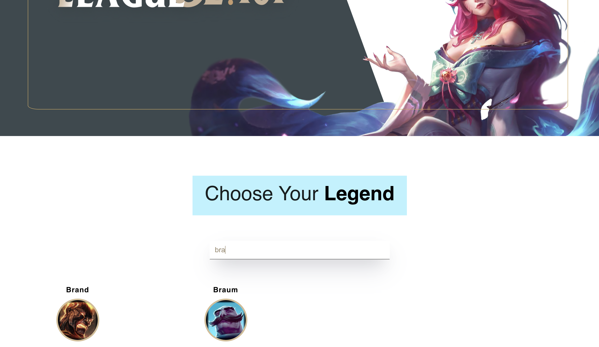

# LOL101
LOL101 is an account stats/game info website targeted mostly towards beginners. Players can search through over 140+ characters and see information such as abilities, recommended items, and pro player builds.

## Home page

## Champion page


## Champion rotation page


## Home page searchbar


## Prerequisites

- [npm](https://www.npmjs.com/get-npm)
- [NodeJS](https://nodejs.org/en/download/)
- [React](https://reactjs.org/docs/getting-started.html)

# Installation

Clone this repository
```bash
git clone git@github.com:JorgeGallegosMS/LOL101.git
```

Run the application
```bash
npm run dev
```


## Demo
Home Page:


Champion Searchbar:


Champion Info:


Champion Rotations:


## Contributors 

[Jorge Gallegos](https://github.com/JorgeGallegosMS)

[Beck Haywood](https://github.com/Beck-Haywood)

[Joanelly Cruz](https://github.com/HolyPi)

[Kento Murata](https://github.com/kmurata798)

